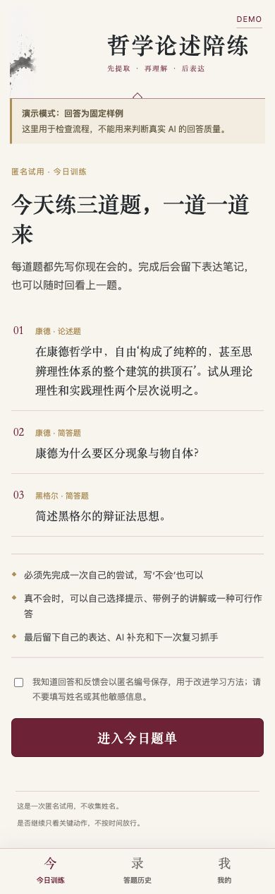
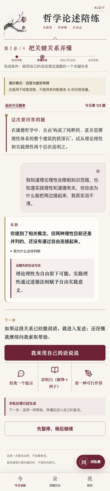

# 哲学学习私教

> 以哲学史为第一门学科的 AI 学习私教，帮助学生把“看过”转化成“理解、能串联、能表达、记得住”。


这不是一个“标准答案库”，而是一套完整的学习闭环：

```text
主动提取 → 诊断卡点 → 最小教学 → 学生复述 → 表达改进 → 延迟复习
```

学生必须先留下自己的真实理解，AI 才根据答案判断：是缺知识、概念有误、关系没有连起来，还是只是表达不够清楚。最终留下的不只有聊天记录，还有可用于下一次出题和复习的个人学习档案。

## 产品截图

<p align="center">
  
  &nbsp;&nbsp;
  
</p>

## 核心能力

- **先答再教**：第一次提交直接回答整道题，“不知道”也是有效的真实起点。
- **结构化诊断**：识别知识缺失、概念误解、关系断裂、表达散乱、基本掌握与延迟复习不稳定。
- **最小教学干预**：学生可以选择提示、带例子的讲解、一种可行作答，或继续追问私教。
- **哲学史知识连接**：围绕时代背景、回应对象、核心概念、思想继承与批判建立关系，而不是孤立背诵概念。
- **表达闭环**：学生用自己的话复述关键关系，再把理解写回原答案；自己的表达与 AI 补充始终分开。
- **个性化复习**：下一题在新题、关系题和到期复习题之间动态选择，三题是基础量，不是上限。
- **学习证据留存**：保存初答、卡点判断、教学干预、改进表达、掌握状态与下次复习时间。
- **试用可观察**：记录关键学习阶段、帮助选择、AI 成功或失败及自愿反馈，帮助判断学生在哪里获得帮助或离开。

## 学员学习流程

1. 查看题目并独立作答。
2. AI 结合题目与学生原话给出首要卡点判断。
3. 学生自主选择提示、讲解、可行作答或自由追问。
4. 学生复述本轮最关键的知识关系。
5. 将新理解写回原答案，形成自己的最终表达。
6. 系统更新掌握状态，并推荐新题、关系题或旧卡点复习题。

时间只记录，不作为放行条件。题目、讲解和学生回答保留在同一条学习时间线中，学生可以暂停、恢复和回看历史训练。

## 系统结构

```text
微信小程序 / 移动端 H5
        │
        ▼
Node.js 教学状态机
        │
        ├── CloudBase AI HTTP API → DeepSeek
        │
        ├── coach_sessions  → 完整训练证据
        ├── learner_mastery → 结构化卡点与复习状态
        ├── question_bank   → 真题种子与复习变式
        │
        └── 飞书多维表格（可选教师侧镜像）
```

`coach_sessions` 保存初答、对话、干预和最终表达；`learner_mastery` 只提取后续教学需要的主题、概念关系、卡点、掌握状态与 `reviewAt`；`question_bank` 保存题目和复习变式。飞书只作可选镜像，写入失败不会阻塞训练。

## 教学方法

每个哲学家或问题都可以沿着同一张内部教学地图理解：

1. 他面对什么时代和思想问题？
2. 他在回应、继承或反对谁？
3. 他提出了哪些核心概念？
4. 这些概念之间是什么关系？
5. 他通过什么路径解决问题？
6. 他对前后哲学史产生了什么影响？
7. 考场上如何把理解表达出来？

系统每轮只选择当前最有帮助的一个抓手，不把整套方法变成学生必须填写的新表单。更完整的教学边界见 [`skills/philosophy-answer-coach/SKILL.md`](./skills/philosophy-answer-coach/SKILL.md)。

## 技术栈

- 前端：微信原生小程序、原生 HTML/CSS/JavaScript
- 服务端：Node.js 20+、原生 HTTP 服务、有限状态教学流程
- AI：DeepSeek，经 CloudBase 服务端调用
- 数据：CloudBase 数据库，可选飞书多维表格镜像
- 验证：Node.js Test Runner、Python `unittest`、行为样例与移动端视觉验收

项目没有运行时第三方 npm 依赖，尽量使用平台原生能力，保持 MVP 简洁。

## 本地运行

需要 Node.js 20 或更高版本。

```bash
cp .env.example .env
set -a
source .env
set +a
npm start
```

打开 `http://localhost:8787/?invite=demo`。默认运行可离线体验的 `mock + memory` 模式，页面会明确显示“演示模式：回答为固定样例”。只有 `/api/health` 返回 `coachMode: "real"` 时，才用于验收真实 AI 回答质量。

## 接入真实 AI 与云端记录

将以下配置写入服务端部署环境，而不是前端或 Git：

```dotenv
COACH_PROVIDER=cloudbase
RECORD_PROVIDER=cloudbase
MIRROR_PROVIDER=feishu
CLOUDBASE_DATABASE_COLLECTION=coach_sessions
CLOUDBASE_MASTERY_COLLECTION=learner_mastery
CLOUDBASE_QUESTION_COLLECTION=question_bank
```

随后补充 `.env.example` 中列出的 CloudBase 服务端凭据；只有需要教师侧飞书镜像时才配置飞书参数。生产环境还必须设置随机的 `SESSION_SIGNING_SECRET`，防止客户端伪造会话记录编号。

CloudBase 可使用根目录 [`Dockerfile`](./Dockerfile) 部署为云托管服务。正式发布后运行 `scripts/verify-production.mjs`，同时检查真实模型、下一题推荐和个人学习档案，不能只凭健康接口成功判断整条学习链路可用。

## 可靠性边界

- 当前不是完整 RAG。精确原句、严格出处和学术争议必须标记资料依据或 `待核实`。
- AI 负责诊断、教学、整理表达和生成复习变式，但不把未核实内容包装成唯一权威答案。
- API Key、试用码、签名密钥与学员数据均不进入仓库；`.env`、`.private/` 和微信私有项目配置已被忽略。
- 小程序在进入训练前要求用户确认隐私说明；遥测只记录影响产品判断的关键行为，不收集无关个人信息。

## 验证

```bash
npm test
python3 -m unittest discover -s tests/philosophy_answer_coach -p 'test_*.py'
npm audit --audit-level=moderate
```

试用流程、行为验收与停止条件见 [`docs/pilot-runbook.md`](./docs/pilot-runbook.md)。

## 项目状态

当前为首轮真实学员试用阶段，Web/H5 与微信小程序两条入口并存。接下来优先依据真实学习记录继续改进卡点判断、复习题生成和教师观察台，而不是扩张成庞大的通用聊天机器人或手工标准答案库。

## 使用许可

本仓库公开用于作品展示、技术交流与产品验证。仓库目前未附开源许可证，不授予复制、分发或商业使用许可。
